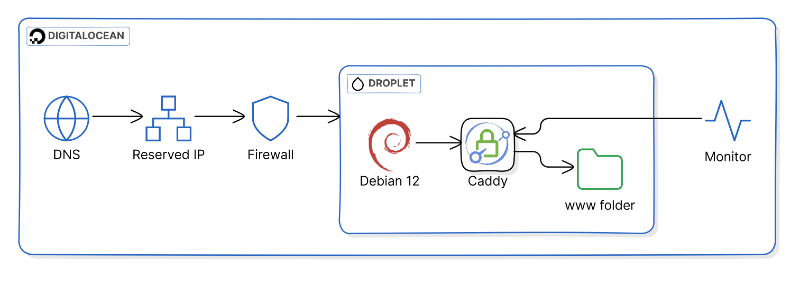
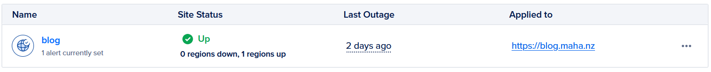

+++
author = 'Andrei Mahalean'
date = '2024-08-16'
draft = false
tags = ['hugo', 'terraform', 'caddy', 'devops']
title = 'Blog Setup'
+++

- [Infrastructure](#infrastructure)
  - [Infra Deployment](#infra-deployment)
- [Authoring](#authoring)
  - [Content Deployment](#content-deployment)
    - [Local](#local)
    - [Github Workflow](#github-workflow)
- [Analytics](#analytics)
- [Monitoring](#monitoring)
- [Optimizations](#optimizations)
- [Future improvements](#future-improvements)

In this post, I explore the technology stack powering this blog, detailing the tools and processes used for both authoring content and deploying the site.

Requirements which I have considered that led me to my final choice:

- **Simple**: I have a full time job and a family. The last thing I want to do is spend time troubleshooting a k8s cluster if my blog is down. I want to take out complexity out of the equation and make sure I have the least amount of tech friction, so I can focus on the content.
- **Cheap**: Predictable cost, no surprises needed. Static monthly fee is ideal.
- **Reproductible**: A side-effect of simplicity, if something is not working and I have spent more than 10 minutes troubleshooting it, blow the whole thing away and re-deploy it easily.
- **Fast**: Minimalistic theme, fast build time, quick deployments. Keep it light (but in dark mode of course).
- **Secure**: Use HTTPS, ensure HSTS and other security headers can be easily set.
- **Governance**: I know I could just do this in GitHub Pages, or some S3/Azure Storage static hosting, but I want to have control over the webserver configuration.

With this in mind, I have decided to host the blog on the smallest DigitalOcean (DO) droplet ($4 USD/month), which comes with 512MB of memory and a 10GB disk, in the Sydney region.

## Infrastructure

The nameservers for my domain were already hosted in DO, so I have configured the DNS hostname for the site `blog.maha.nz` to point to the reserved (floating) IP which is attached to the droplet. The DO firewall is allowing inbound ports for SSH and HTTP(S) and blocking everything else.



Normally my pick of server OS would be the latest Ubuntu LTS, but I have been unhappy with Canonical forcing snaps down our throats, so I have decided to go back to good ol' Debian, which will not let me down.

NGINX is usually my choice of webserver, but I had heard good things about Caddy and was willing to give it a try. Caddy has a very simple configuration (Caddyfile) and will automatically sort out the TLS certificate using LetsEncrypt, nice and simple.
For this scenario, Caddy simply serves the `/var/www/html` folder, where all the Hugo static content is uploaded to.

For the time being, a very basic uptime monitor is configured in DigitalOcean which will automatically email me when the site is down. I plan to expand on this later on and add more checks, both for the OS & the services.



By now, you may be thinking _"This sure sounds like a lot of manual configuration"_. Let me re-assure you that all of this is deployed via Terraform, then I make use of cloud-init user data to configure the OS and webserver to the point where Caddy serves an empty folder.

The Terraform code looks like this:

- First I create the cloud init configuration, which comes in two stages:

```hcl
data "cloudinit_config" "blog" {
  gzip          = false
  base64_encode = false

  part {
    filename     = "cloud-config.yaml"
    content_type = "text/cloud-config"

    content = file("${path.module}/cloud-config.yaml")
  }

  part {
    filename     = "setup-caddy.sh"
    content_type = "text/x-shellscript"

    content = file("${path.module}/setup-caddy.sh")
  }
}
```

In the first stage, the `cloud-config.yaml` installs some base packages via apt, creates the caddy user which the webserver runs as, adds the pubkey for this user so I can deploy using ssh with key auth. Finally it installs the Caddy webserver.

```yaml
#cloud-config
package_update: true
package_upgrade: true

packages:
  - curl
  - debian-keyring
  - debian-archive-keyring
  - apt-transport-https
  - gnupg
  - rsync
  - lsof

users:
  - name: caddy
    ssh_authorized_keys:
      - 'ssh-ed25519 AAAAC3NzaC1lZDI1NTE5AAAAICB5N1kyv35KTvDXBrqDs4n1x/mQPxk2eC/h7/htnyOx caddy@blog.maha.nz'

runcmd:
  # Add Caddy official repository
  - curl -1sLf 'https://dl.cloudsmith.io/public/caddy/stable/gpg.key' | gpg --dearmor -o /usr/share/keyrings/caddy-stable-archive-keyring.gpg
  - curl -1sLf 'https://dl.cloudsmith.io/public/caddy/stable/debian.deb.txt' | tee /etc/apt/sources.list.d/caddy-stable.list
  # Update package list
  - apt update
  # Install Caddy
  - apt install -y caddy
```

- In the next stage, the `setup-caddy.sh` script is executed. This creates the public www folder, sets up the permissions for it and applies the Caddyfile configuration:

```bash
#!/bin/sh

PUBLIC=/var/www/html

mkdir -p ${PUBLIC}
chown -R caddy:caddy ${PUBLIC}

cat << EOF > /etc/caddy/Caddyfile
{
  email REDACTED
}

blog.maha.nz {
  root * ${PUBLIC}
  file_server

  # Add multiple headers
  header {
      X-Frame-Options "deny"
      X-XSS-Protection "1; mode=block"
      Content-Security-Policy: "default-src 'none'; manifest-src 'self'; font-src 'self'; img-src 'self'; style-src 'self'; form-action 'none'; frame-ancestors 'none'; base-uri 'none'"
      X-Content-Type-Options: "nosniff"
      Strict-Transport-Security: "max-age=31536000; includeSubDomains; preload"
      Cache-Control: max-age=31536000, public
      Referrer-Policy: no-referrer
      Feature-Policy: microphone 'none'; payment 'none'; geolocation 'none'; midi 'none'; sync-xhr 'none'; camera 'none'; magnetometer 'none'; gyroscope 'none'
  }
}
EOF

systemctl restart caddy
```

This data block is passed as the `user_data` attribute when we create the droplet:

```hcl
resource "digitalocean_droplet" "web" {
  image  = "debian-12-x64"
  name   = "do-web-1"
  region = "syd1"
  size   = "s-1vcpu-512mb-10gb"

  user_data = data.cloudinit_config.blog.rendered
}
```

Now the webserver is up, and Caddy has configured a TLS certificate, but no content has been uploaded yet to the public folder, it is at this point where we will start getting a `404` status code response for our root `https://blog.maha.nz/`. Before this, we do not get any HTTP response because the web server is still launching.

The content can be deployed now, and I will cover that process in the [Authoring > Deployment](#content-deployment) section.

### Infra Deployment

I use HCP Terraform free tier to deploy all DigitalOcean infrastructure, including my DNS records.
For deploying I use a VCS workflow, where a push to my private infra GitHub repo will trigger a Terraform plan & apply.

## Authoring

The blog is hosted as a [github public repository](https://github.com/mahalel/blog-maha-nz). The source directory for Hugo is the `./src` folder. To add a new post I add it as Markdown to the `./src/content` folder. The theme is the [Hugo Bear Cub theme](https://github.com/clente/hugo-bearcub) which is added as a Git submodule.

Dependencies are installed via the nix flake available at the root of the repository, this can be loaded either manually with `nix develop` or with a [direnv](https://github.com/direnv/direnv) configuration that applies the flake when you enter the root folder.

I edit the `md` files with my primary editor [helix](https://helix-editor.com/) or with Visual Studio Code as my backup editor if that is ever needed.

### Content Deployment

#### Local

My SSH config is configured with the user, host & identity file for the blog. With this in place I can simply run the [deploy.sh](https://github.com/mahalel/blog-maha-nz/blob/main/deploy.sh) script locally and it will build the site then rsync it over.

This is simple and fast enough for my needs, I may wrap this up in a Makefile or [Taskfile](https://taskfile.dev/) later on.

#### Github Workflow

A Github action has been setup which will deploy the site contents. This can be trigerred on push, manually, and it will also run on a schedule every 5 minutes. The 5 minutes is a best effort though, as Github can [delay your schedule](https://docs.github.com/en/actions/writing-workflows/choosing-when-your-workflow-runs/events-that-trigger-workflows#schedule) during periods of high loads.

The workflow first checks the status code returned by a `curl` GET request to the root of the blog. When the response status code is 404 it means that I have redeployed the infra and the droplet has been rebuilt. Because the webserver responds to http traffic, but there is no content at the root, it is implied that the site is ready to have its content re-deployed, so the workflow will execute.

The deployment is a recreation of the rsync deploy script, as GitHub actions. Hugo is pinned to a specific version which _should_ match the version retrieved via the nix flake.

The ECDSA key that allows the rsync command to succeed is read as a GitHub secret, we need to disable StrictHostKey checking and ignore known hosts signature because each droplet rebuild will give us a different host key.

I will consider adding a GitHub self-hosted runner in the future if I want to reduce the time the site is unavailable between rebuilds, but at this point I am ok with this tradeoff.

## Analytics

None. I was toying with the idea of using Matomo but I then realised focusing on the numbers would be the wrong incentive for writing. I decided to proceed without any analytics.

## Monitoring

For now, I am using a Digitalocean HTTP Uptime Check which will email me when there is no response to a HTTPS request. After I rebuild my home server I will switch it over to use [Uptime Kuma](https://github.com/louislam/uptime-kuma)

## Optimizations

HTTP Observatory is a free online tool that scans websites for security vulnerabilities and best practices, I have used it to help me improve the web security of the site by providing detailed reports and recommendations on various security headers, SSL/TLS configuration, and other critical security measures.

Based on the recommendations, I have managed to [achieve an A+ score](https://developer.mozilla.org/en-US/observatory/analyze?host=blog.maha.nz) with the following Caddyfile configuration:

```txt
blog.maha.nz {
  root * ${PUBLIC}
  file_server

  # Add multiple headers
  header {
      X-Frame-Options "deny"
      X-XSS-Protection "1; mode=block"
      Content-Security-Policy: "default-src 'none'; manifest-src 'self'; font-src 'self'; img-src 'self'; style-src 'self'; form-action 'none'; frame-ancestors 'none'; base-uri 'none'"
      X-Content-Type-Options: "nosniff"
      Strict-Transport-Security: "max-age=31536000; includeSubDomains; preload"
      Cache-Control: max-age=31536000, public
      Referrer-Policy: no-referrer
      Feature-Policy: microphone 'none'; payment 'none'; geolocation 'none'; midi 'none'; sync-xhr 'none'; camera 'none'; magnetometer 'none'; gyroscope 'none'
  }
}
```

## Future improvements

- Update monitoring to Uptime Kuma
- Wrap up the deploy in a taskfile
- Add self-hosted runner for shorter downtime
- Convert all images to WEBP automatically when Hugo generates the site
